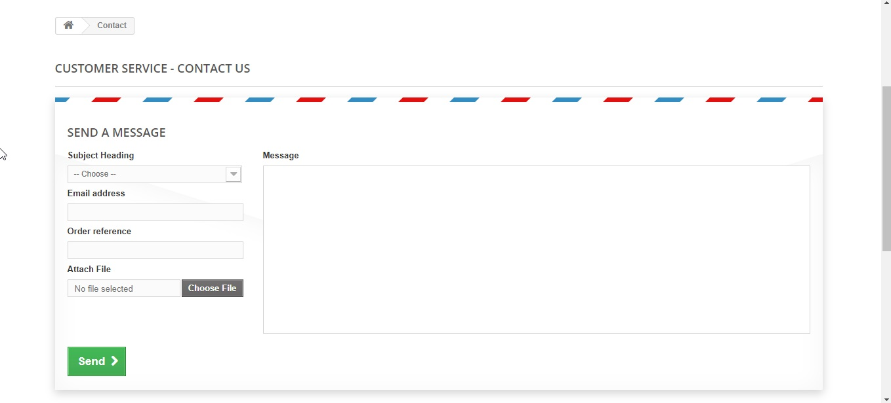
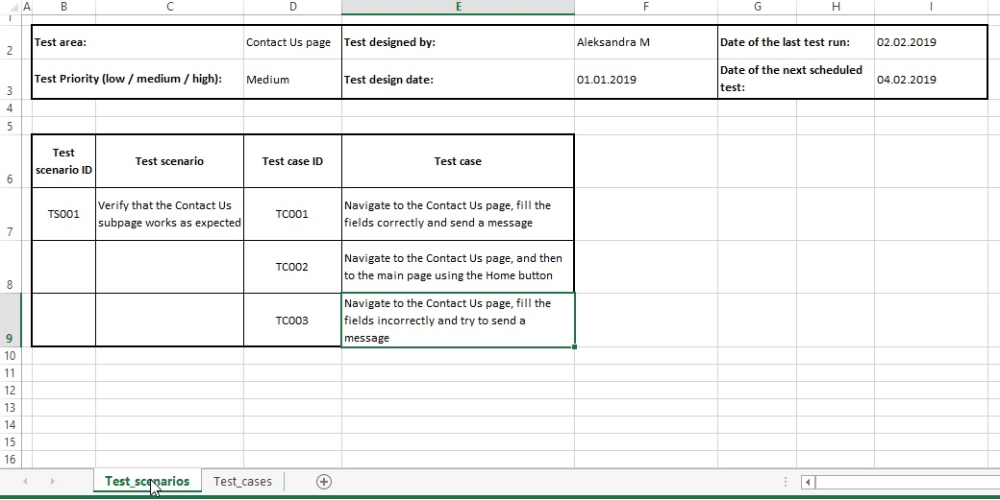
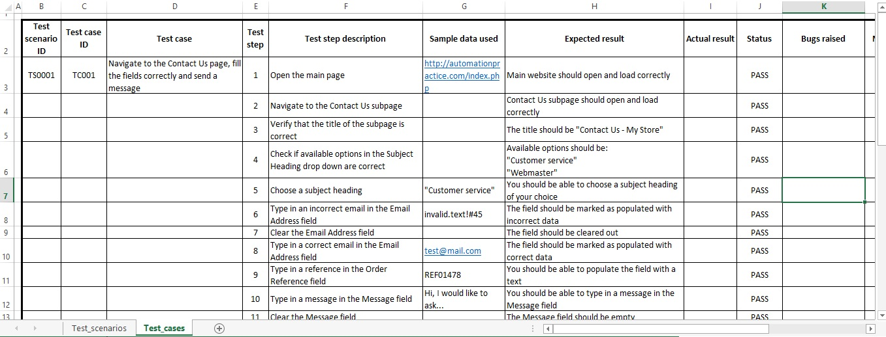

# ContactUsPage
An implementation of a test scenario covering the test of a Contact Us demo page. Testing performed in Firefox browser. Code implemented in Eclipse using Selenium WebDriver. The results of the automated test are saved into an Excel file that contains a test scenario and test cases.

### Prerequisites
To run the project, you will need:
* JDK 8 - you can download [here](https://www.oracle.com/technetwork/java/javase/downloads/jdk8-downloads-2133151.html)
* Eclipse - you can download [here](https://www.eclipse.org/downloads/packages/).
* Selenium WebDriver - used version 3.141.59.
You can download [here](https://www.seleniumhq.org/download/).
* Apache POI - used version 4.1.0.
You can download [here](https://poi.apache.org/download.html#POI-4.1.0).
* Gecko Driver - 
It's already added to the project in the /libs folder, but for your own purposes you can download [here](https://github.com/mozilla/geckodriver/releases).

### Running the test

In order to perfom the testing, run main/TestScript.java file. It handles individual test cases located in the /testcases package.

Address of a website being tested:
http://automationpractice.com/index.php?controller=contact

Screenshot of a wesbite being tested:

Sample screenshots of the Excel file:
ContactUsPage/images/

### Acknowledgments
* _Selenium Testing Tools Cookbook_, Second Edition, Unmesh Gundecha
* Youtube videos
* Online tutorials - e.g. www.toolsqa.com, www.guru99.com
